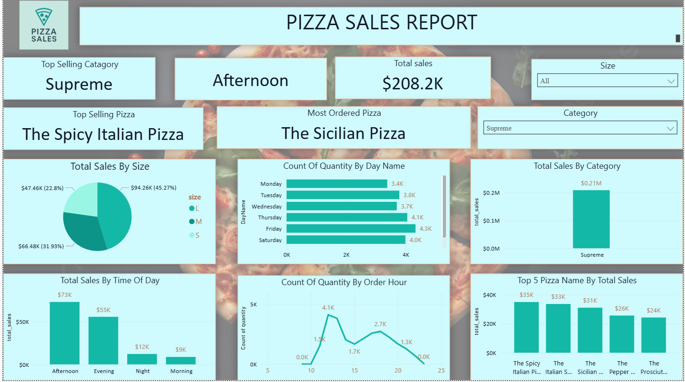

# 🍕 Pizza Sales Performance Dashboard (Power BI)

**This dashboard analyzes pizza sales data to uncover key performance trends, customer behavior, and time-based patterns.** Built in Power BI, it's designed with business clarity, visual consistency, and storytelling in mind.

---

## 🔍 Key Highlights

- 📊 Sales breakdown across categories and pizza sizes (S to XXL)
- 🕒 Time-based insights by hour, weekday, and time of day
- 🔝 Best-performing pizzas based on revenue
- 🎯 Dynamic filters and clean KPIs
- 🎨 Custom teal theme with smooth typography and layout

---

## 🧰 Tools Used

- Microsoft Power BI Desktop  
- DAX (Data Analysis Expressions)  
- Data modeling and transformation  
- Fonts: Segoe UI (headers), Calibri (main text)

---

## 📁 Files Included

| File Name              | Description                              |
|------------------------|------------------------------------------|
| `PizzaSalesReport.pbix`| Full Power BI dashboard                  |
| `pizza_logo.png`       | Custom logo used in the report           |
| `dashboard_preview.png`| Embedded preview of the dashboard        |

> ⚠️ This project uses **sample/mock data** and is intended for demo and portfolio purposes only.

---

## 📸 Dashboard Preview

  
👉 [Click here to view full size](https://github.com/Fuqqu1711/Pizza-Sales-Report/blob/main/Pizza%20Sales%20Performance%20Dashboard.PNG)

---

## ✨ About the Project

This dashboard was created to:

- Demonstrate clean Power BI practices and visual storytelling  
- Translate raw sales data into actionable insights  
- Serve as a polished portfolio piece for BI, data, or analytics roles

---

> Built with flavor, filters, and formulas by **Fuqqu** 🍕  
> GitHub Repo → [Pizza-Sales-Report](https://github.com/Fuqqu1711/Pizza-Sales-Report)
